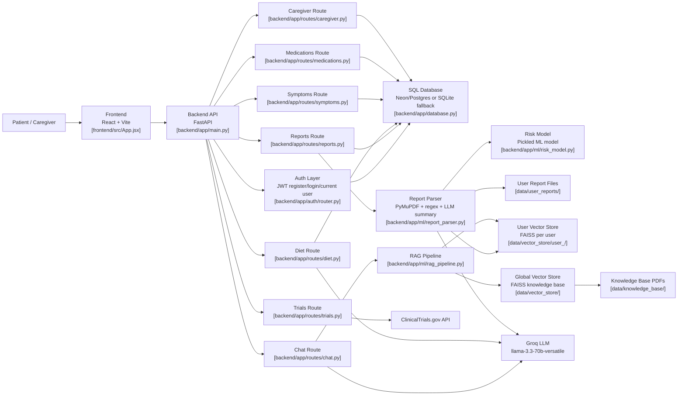
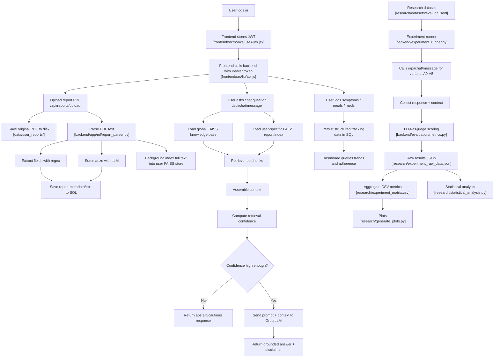

# CancerCare AI

AI-powered cancer support platform with a FastAPI backend, React frontend, and LLM-powered clinical features.

## Core Features

- AI chatbot with RAG over medical references and uploaded patient reports
- Structured report parsing from uploaded documents
- Personalized diet planning support
- Symptom and sentiment tracking
- Medication tracking workflow
- Clinical trial lookup integration
- Caregiver/patient linking and role-aware access
- JWT authentication and protected routes

## Repository Structure

- `backend/`: FastAPI app, ML pipelines, database/auth routes, tests
- `frontend/`: Vite + React web UI
- `research/`: Evaluation scripts, datasets, and experiment assets
- `data/`: Local user report and vector-store data (ignored from Git)

## Tech Stack

| Layer | Technology |
|---|---|
| Frontend | React + Vite |
| Backend | FastAPI (Python) |
| NLP/LLM | Hugging Face, Gemini, Groq |
| Vector Store | FAISS |
| Databases | PostgreSQL (Neon), MongoDB |
| Auth | JWT |

## Local Setup

### 1) Backend

```bash
cd backend
python -m venv venv
venv\Scripts\activate
pip install -r requirements.txt
uvicorn app.main:app --reload --port 8000
```

### 2) Frontend

```bash
cd frontend
npm install
npm run dev
```

### 3) Optional one-click launcher (Windows)

```bat
run_project.bat
```

## Environment Variables

Create `.env` files for backend/frontend as needed. Common backend variables include:

- `GEMINI_API_KEY`
- `GROQ_API_KEY`
- `MONGODB_URI`
- `NEON_POSTGRES_URL`
- `JWT_SECRET_KEY` (or equivalent auth secret used by your config)

## Testing

Backend tests:

```bash
cd backend
pytest
```

Frontend lint:

```bash
cd frontend
npm run lint
```
## Architecture Diagram 

## Dataflow Diagram 


## Notes

- Large/generated assets (FAISS indexes, uploaded reports, caches) are excluded via `.gitignore`.
- Keep secrets out of version control.

## Medical Disclaimer

CancerCare AI is for educational and support purposes only and does not provide medical diagnosis or treatment advice. Always consult a licensed healthcare professional.
