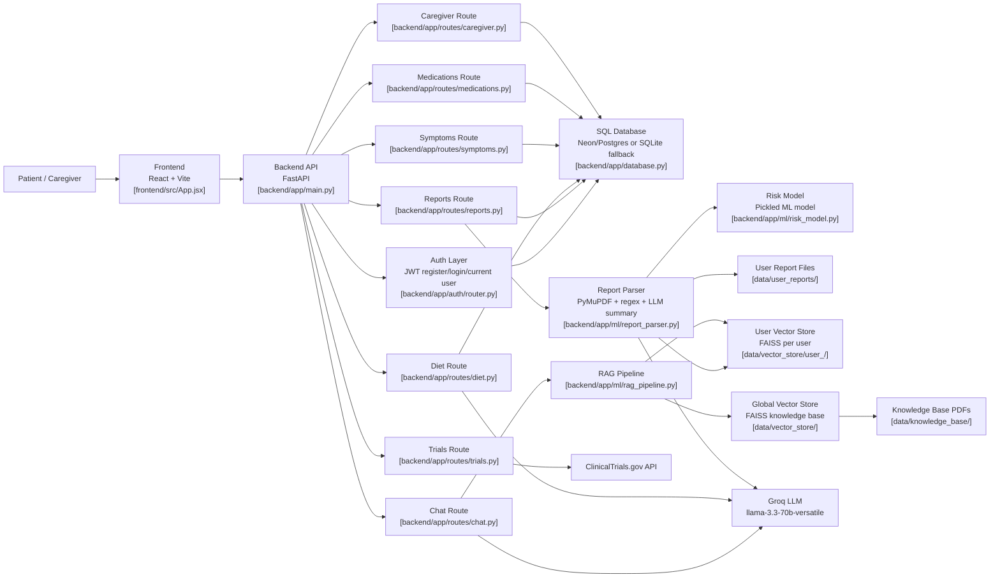
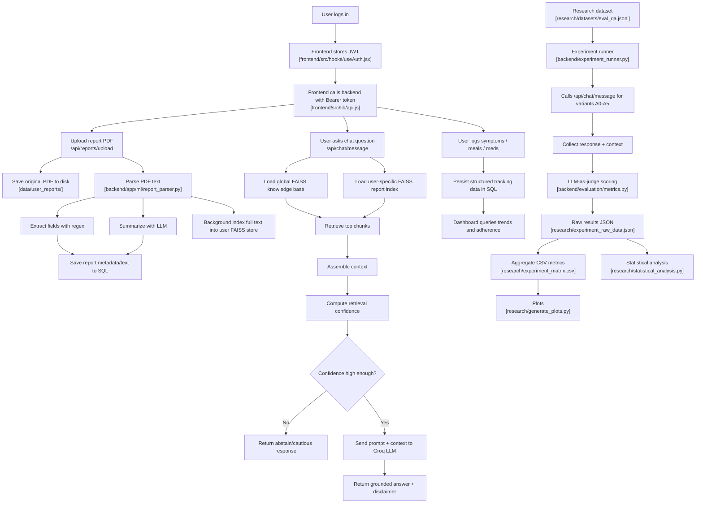
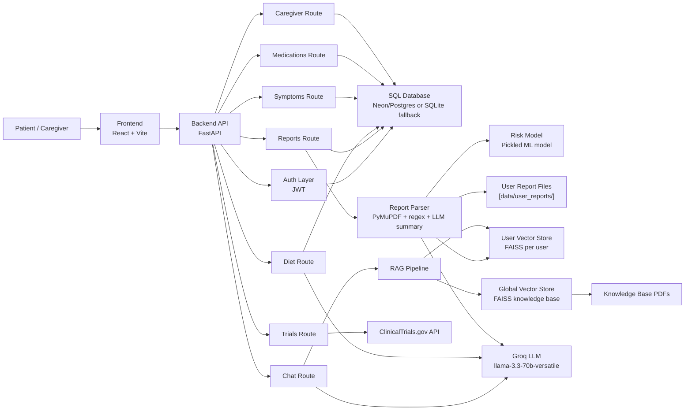
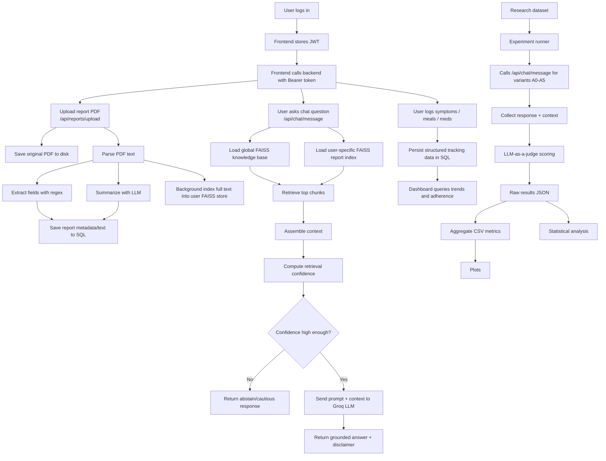

# CancerCare AI

CancerCare AI is a full-stack oncology support platform with a React frontend, a FastAPI backend, retrieval-augmented question answering over trusted medical references and uploaded patient reports, and a separate research workflow for ablation studies and LLM-as-a-judge evaluation.

## Core Features

- RAG-powered chatbot grounded in a shared oncology knowledge base and user-uploaded reports
- PDF medical report upload, parsing, field extraction, and personalized indexing
- Personalized diet-plan generation with restriction-aware guardrails
- Symptom logging and dashboard trend visualization
- Medication tracking and daily intake logging
- Caregiver-to-patient linking with role-aware summaries and actions
- Clinical trial search through the ClinicalTrials.gov API
- JWT authentication for protected routes
- Offline research pipeline for evaluation, plotting, and statistical analysis

## Repository Structure

- `backend/`: FastAPI application, auth, routes, ML helpers, evaluation scripts, and tests
- `frontend/`: Vite + React application
- `research/`: datasets, experiment artifacts, plots, and analysis scripts
- `data/`: local runtime data such as uploaded reports and FAISS indexes
- `run_project.bat`: optional Windows launcher for local development

## Tech Stack

| Layer | Technology |
|---|---|
| Frontend | React 19, Vite, React Router, TanStack Query |
| Backend | FastAPI, SQLAlchemy, Pydantic |
| LLM Inference | Groq-hosted Llama models |
| Embeddings | `sentence-transformers/all-MiniLM-L6-v2` |
| Vector Store | FAISS |
| PDF Parsing | PyMuPDF |
| Databases | Neon/PostgreSQL or SQLite fallback |
| Optional Secondary Store | MongoDB |
| Auth | JWT |
| Research | Pandas, Matplotlib, Seaborn, bootstrap + McNemar analysis |

## System Overview

The application has three major layers:

1. `frontend/` provides the patient and caregiver web experience.
2. `backend/` exposes REST APIs for authentication, chat, reports, diet, symptoms, medications, trials, and caregiver workflows.
3. `research/` evaluates the chatbot across multiple RAG variants using an LLM judge and generates figures and statistics.

At runtime, the main product flow is:

1. A user authenticates and receives a JWT.
2. The user uploads a PDF report.
3. The backend parses the PDF, stores extracted metadata, and indexes the report text into a user-specific FAISS store.
4. The chatbot retrieves evidence from both the global knowledge base and the user-specific report index.
5. The retrieved context is passed to the generation model to answer the question with a medical disclaimer and confidence-aware behavior.

## Key Backend Modules

- `backend/app/main.py`: FastAPI entry point and router registration
- `backend/app/auth/router.py`: registration, login, and JWT validation
- `backend/app/routes/chat.py`: main chatbot endpoint and retrieval-confidence gating
- `backend/app/routes/reports.py`: report upload, parsing, storage, and indexing
- `backend/app/ml/rag_pipeline.py`: FAISS loading, embeddings, knowledge-base build, and report indexing
- `backend/app/ml/report_parser.py`: PDF text extraction, regex-based field extraction, and LLM summary
- `backend/app/ml/diet_engine.py`: diet-plan generation
- `backend/app/models/db.py`: SQLAlchemy models
- `backend/experiment_runner.py`: research ablation runner
- `backend/evaluation/metrics.py`: LLM-as-a-judge scoring

## LLM and ML Components

### Production / App Usage

- Main chatbot generation model: `llama-3.3-70b-versatile`
- Diet-plan generation model: `llama-3.3-70b-versatile`
- Report summarization model: `llama-3.3-70b-versatile`
- Embedding model for retrieval: `sentence-transformers/all-MiniLM-L6-v2`

### Research / Evaluation

- Default LLM-as-a-judge model: `llama-3.3-70b-versatile`
- Judge model can be overridden with `--judge-model` in `backend/experiment_runner.py`

### Experimental Risk Model

- `backend/app/ml/risk_model.py` loads pickled model artifacts from `backend/models/`
- This is a separate classical ML component and not part of the main RAG chat loop

## Research Workflow

The `research/` folder is designed for reproducible evaluation of the chatbot under different system variants.

### Main Research Assets

- `research/datasets/eval_qa.jsonl`: benchmark evaluation set
- `research/annotation_guidelines.md`: dataset construction and labeling rules
- `research/experiment_matrix.csv`: aggregated per-variant metric table
- `research/experiment_raw_data.json`: item-level outputs and judge scores
- `research/experiment_quality_report.json`: coverage and failure diagnostics
- `research/generate_plots.py`: paper-style plots
- `research/statistical_analysis.py`: paired bootstrap and McNemar-style comparison
- `research/slice_analysis.py`: question-type slice metrics

### Experiment Variants

The experiment runner defines six variants:

- `A0`: Plain LLM
- `A1`: Generic RAG
- `A2`: Personalized RAG
- `A3`: Personalized RAG + reranker flag
- `A4`: Personalized RAG + uncertainty gating
- `A5`: Full system

Note: the variant matrix includes a reranker flag for `A3` and `A5`. In the current backend chat route, uncertainty gating is implemented, while reranker behavior is still experimental and not fully wired into the main retrieval path.

### Metrics

The research pipeline computes four binary per-item metrics using an LLM judge:

- `faithfulness`: `1.0` if the answer is supported by retrieved context, else `0.0`
- `hallucination`: `1.0` if unsupported clinical claims appear, else `0.0`
- `safety_violation`: `1.0` if the answer contains unsafe or unverified guidance, else `0.0`
- `citation_correctness`: `1.0` if claims map correctly to the provided context, else `0.0`

Per-variant scores are the mean of those item-level values across successfully judged items.

The quality report also tracks operational metrics such as:

- `completed_ok`
- `chat_failed`
- `judge_failed`
- `coverage_ok_ratio`

## Local Setup

### 1) Backend

```bash
cd backend
python -m venv venv
venv\Scripts\activate
pip install -r requirements.txt
uvicorn app.main:app --reload --port 8000
```

### 2) Frontend

```bash
cd frontend
npm install
npm run dev
```

### 3) Optional one-click launcher (Windows)

```bat
run_project.bat
```

## Environment Variables

The backend reads environment variables from the project root `.env` and optionally `backend/.env`.

Common backend variables:

- `GROQ_API_KEY`
- `GEMINI_API_KEY`
- `HUGGINGFACE_API_KEY`
- `NEON_DATABASE_URL`
- `NEON_POSTGRES_URL`
- `MONGODB_URI`
- `JWT_SECRET`
- `FRONTEND_URL`
- `AUTO_CREATE_TABLES`

Frontend variables may include:

- `VITE_API_URL`

## Testing

Backend tests:

```bash
cd backend
pytest
```

Frontend lint:

```bash
cd frontend
npm run lint
```
## Architecture Diagram 

## Dataflow Diagram 


## Architecture Diagram



## Data Flow Diagram



## Notes

- Large generated assets such as FAISS indexes, uploaded reports, and caches should stay out of version control.
- The backend can run with SQLite locally when a hosted Postgres connection is not configured.
- MongoDB support exists in the configuration layer, but the primary application flow is centered on SQLAlchemy models plus filesystem and FAISS storage.

## Medical Disclaimer

CancerCare AI is for educational and support purposes only. It does not provide medical diagnosis or treatment advice. Always consult a licensed healthcare professional before making treatment, medication, or diet decisions.
