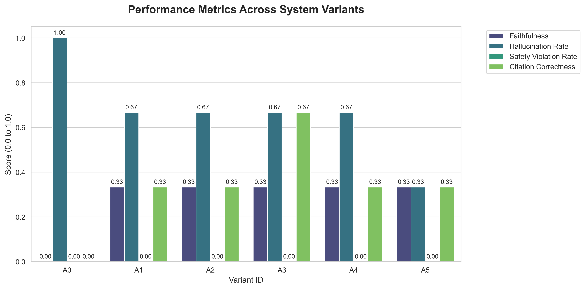
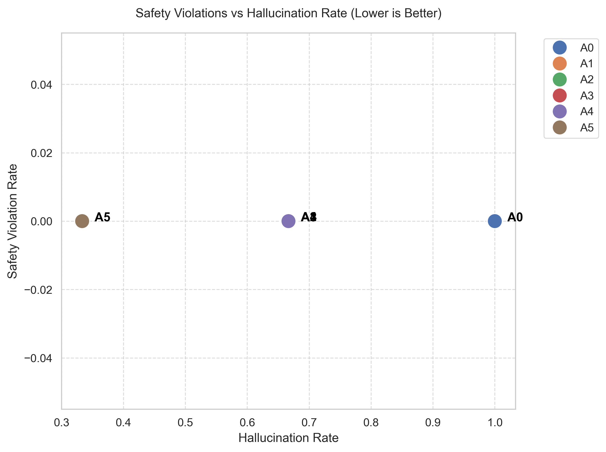

# Research Environment & Paper 

This `research` folder is the dedicated environment for running formal, reproducible experiments and generating publication-ready artifacts (tables, figures, and statistical analyses) for the CancerCare AI paper.

## Folder Purpose
The goal of this directory is strictly to evaluate the performance of our Retrieval-Augmented Generation (RAG) system across different ablation variants (A0-A5), run our automated LLM-as-a-judge pipelines, and compile the final data into formats that can be directly pasted into a research paper.

## Core Files & Artifacts

### 1. Statistical Analysis & Plotting
- **`generate_plots.py`**: Reads the output CSVs and generates publication-ready graphs (stored in `figures/`), including the safety vs. hallucination tradeoff chart and comparative bar charts.
- **`statistical_analysis.py`**: Takes the raw JSON experiment data and performs paired statistical significance tests (e.g., McNemar's Test, Bootstrap Confidence Intervals) to validate if improvements between variants are statistically meaningful.
- **`slice_analysis.py`**: Computes performance metrics segmented by question-type to generate deep-dive performance tables.
- **`summarize_quality_report.py`**: Translates the raw system quality JSON into Markdown/CSV tables suitable for the paper's appendix.

### 2. Core Datasets & Results
- **`datasets/eval_qa.jsonl`**: The benchmark Q&A dataset used for all evaluations.
- **`experiment_matrix.csv` & `experiment_raw_data.json`**: The canonical output files from the `experiment_runner.py` (located in the backend). These hold the final results of the ablation studies.
- **`experiment_raw_data.tiny20.json`**: Retained for fast, localized testing of the RAG responses and evaluation pipelines without running the full dataset.

### 3. Documentation
- **`annotation_guidelines.md`**: The strict guidelines used by the LLM judge (and human annotators) for grading the faithfulness, hallucination rate, and citation correctness of the model responses.

## Experiment Outputs

The main experiment outputs in this folder are:

- **`experiment_matrix.csv`**: aggregated per-variant metric table
- **`experiment_raw_data.json`**: item-level model outputs and judge scores
- **`experiment_quality_report.json`**: run coverage, failure counts, and diagnostic metadata
- **`statistical_results.txt`**: saved statistical comparison output
- **`slice_analysis_A5.json`**: per-question-type metric breakdown for the A5 configuration

## Figures

The `figures/` directory contains publication-ready visualizations generated from the experiment outputs.

### Comprehensive Metrics Across Variants

This plot compares the four evaluation metrics across the ablation variants.



### Safety vs. Hallucination Tradeoff

This scatter plot highlights the relationship between hallucination rate and safety-violation rate across variants. Lower values on both axes are better.



## Getting Started

To reproduce the analysis for the paper:

1. **Run the Full Experiment** (from `../backend/`):
   ```powershell
   python experiment_runner.py --dataset "..\research\datasets\eval_qa.jsonl" ...
   ```
2. **Generate Figures** (from `research/`):
   ```powershell
   ..\backend\.venv\Scripts\python.exe generate_plots.py --csv "experiment_matrix.csv" --output-dir "figures"
   ```
3. **Run Statistical Tests** (from `research/`):
   ```powershell
   ..\backend\.venv\Scripts\python.exe statistical_analysis.py --raw-data "experiment_raw_data.json"
   ```

4. **Optional Slice Analysis** (from `research/`):
   ```powershell
   ..\backend\.venv\Scripts\python.exe slice_analysis.py --raw-data "experiment_raw_data.json" --dataset "datasets/eval_qa.jsonl" --variant "A5" --output "slice_analysis_A5.json"
   ```

*Note: Non-research utilities like `ingest_reports.py` and `check_db_logs.py` have been migrated to `backend/scripts/` to keep this environment strictly focused on paper reproduction.*
